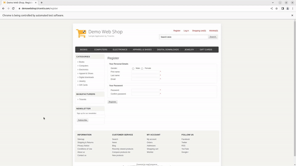

<!-- PROJECT HEADER -->

  <!--PROJECT TITLE AND DESCRIPTION -->
 <h1 align="center">Automation of DemoWebShop Web Application Using Selenium, TestNG and Cucumber</h1> 

  

    A web automation project to automate testing process of DemoWebShop E-commerce Web Application built using Selenium and TestNG in Java.
      
    
    
  

<!-- ABOUT THE PROJECT -->

## About The Project
Automation of the [DemoWebShop E-commerce](https://demowebshop.tricentis.com/) web application using Selenium, TestNG and Cucumber focuses on validating key functionalities like register account, login, add gift card to the cart, and placing an order. Selenium is employed for interacting with the web interface, while TestNG is used to manage test execution and reporting.

* Register Account: Automation scripts to simulate a user account registration with valid credentials.
* Login Functionality: Automation scripts simulate a user logging in with valid credentials.
* Add Gift Card to Cart: The script selects a product, adds it to the cart, and validates that the cart updates correctly by verifying the product count and details.
* Place Order: The automation flow proceeds to checkout, fills in the necessary shipping and payment details, and confirms the order.

### Built With
* [Java 8](https://www.oracle.com/java/technologies/javase/javase-jdk8-downloads.html) as programming language
* [Maven](https://maven.apache.org/) for Package Management and Build Automation
* [Selenium](https://www.selenium.dev/) for Web Automation
* [TestNG](https://testng.org/) for Java testing framework that supports annotations, parallel execution, and detailed reporting for efficient test automation.
* [Cucumber](https://cucumber.io/docs/cucumber/) for writing BDD-style tests in Gherkin syntax.

